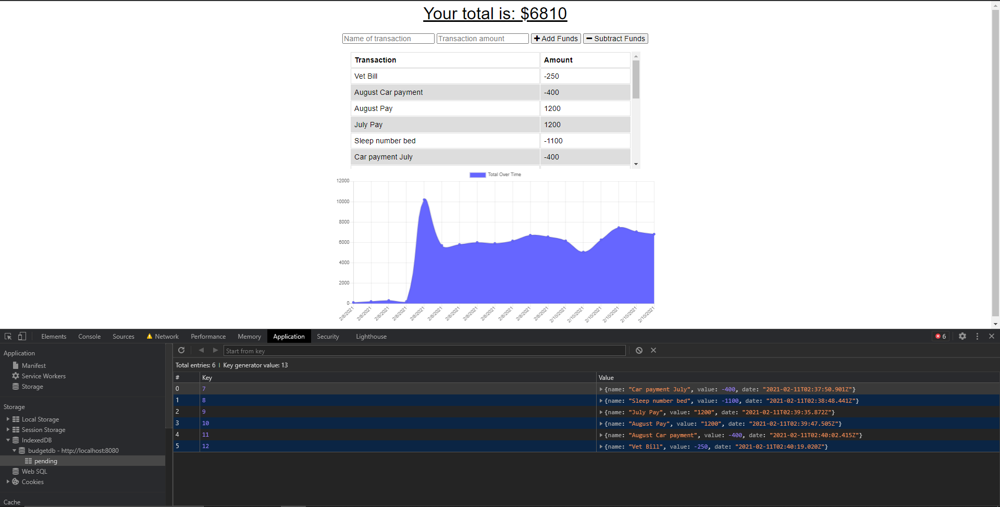

# budget_tracker

## Desription
    The purpose of this assignment was to complete create functionality that would allow the application to still be utilized offline. Then once back online, it would add the updated information to the database.

    Application will be deployed on Heroku using Mongo Atlas.

## Table of Contents
 - [Installation](#installation)
 - [Usage](#usage)
 - [License](#license)
 - [Contributing](#contributing)
 - [Tests](#tests)
 - [Questions](#questions)

## Installation
    espress, mongoose, logger, compression   
## Usage
    
## License
    MIT License
## Contributing
    Nick Leoni
## Tests
    
## Questions
[GitHub Repo Link](https://github.com/njleoni/budget_tracker) 
[Heroku Link](https://powerful-spire-65295.herokuapp.com/)
#### If you have any additional questions, please contact me at nicholas.leoni@gmail.com

## Screenshot

